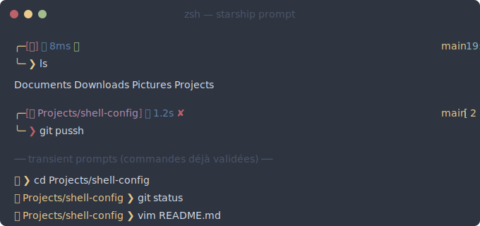

# shell-config

Configuration zsh minimaliste avec [starship](https://starship.rs/), thème Nord, transient prompt et chargement rapide.



Remplace `oh-my-zsh` + `oh-my-posh` par du zsh pur + starship. Tous les plugins utiles (autosuggestions, syntax highlighting, completion, colored man pages) sont conservés mais sourcés directement, sans framework intermédiaire.

## Fonctionnalités

- **Prompt deux lignes** avec palette Nord : chemin avec icône maison, durée de commande, statut `✓`/`✘`, branche git avec compteurs de changements, heure, batterie.
- **Transient prompt** : les prompts validés se simplifient en `󰋜 path ❯`, gardant l'historique lisible.
- **Icône maison conditionnelle** : `󰋜` seul dans `$HOME`, `󰋜 sous-dossier` ailleurs.
- **Démarrage rapide** : ~50-100 ms contre 400+ ms avec oh-my-zsh + oh-my-posh.
- **NVM en lazy-loading** : ne s'initialise qu'au premier `node`/`npm`.
- **`compinit` mis en cache** : vérifie `.zcompdump` une fois par jour.
- **Intégration atuin et zoxide** si installés.

## Prérequis

- zsh
- Une [Nerd Font](https://www.nerdfonts.com/) dans le terminal (pour les icônes `󰋜`, ``, ``, ``, etc.)
- `curl` (pour installer starship si absent)

Outils optionnels détectés à l'installation, chargés conditionnellement :

| Outil | Rôle | Install Debian/Ubuntu |
|---|---|---|
| `starship` | moteur de prompt (requis) | script officiel |
| `zoxide` | `cd` intelligent basé sur l'historique | `apt install zoxide` |
| `atuin` | historique shell enrichi et recherchable | `curl -sS https://setup.atuin.sh \| sh` |
| `eza` | remplacement moderne de `ls` | `apt install eza` |
| `bat` | remplacement de `cat` avec coloration syntaxique | `apt install bat` |
| `fzf` | fuzzy finder (utilisé par les fonctions `g`, `d`, `s`) | `apt install fzf` |

## Installation

Un seul script fait tout — backup de l'existant, vérification des outils, écriture de `~/.config/starship.toml` et `~/.zshrc`.

```bash
git clone https://github.com/<user>/shell-config.git
cd shell-config
bash setup-shell.sh
exec zsh
```

Le script est idempotent : tu peux le relancer sans rien casser. Chaque exécution crée un backup horodaté dans `~/.config-backup-YYYYMMDD-HHMMSS/`.

## Structure du prompt

```
╭─[ 󰋜 path ] 󱑓 duration ✓/✘                     branch [status]  hh:mm  󰁹 %
╰─    ❯ 
```

| Segment | Rôle | Couleur (palette Nord) |
|---|---|---|
| `╭─` `╰─` | bras décoratifs | nord13 (jaune chaud) |
| `[ ]` | délimiteurs du chemin | nord11 (rouge) |
| `󰋜 path` | icône maison et chemin tronqué à 3 niveaux | nord15 (violet) |
| `󱑓 duration` | temps d'exécution avec millisecondes | nord10 (bleu) |
| `✓` / `✘` | statut de la commande précédente | nord14 vert / nord11 rouge |
| `   ` | trois diamants décoratifs | nord14 / nord13 / nord12 |
| `❯` | chevron final (vert si succès, rouge si erreur) | nord13 / nord11 |
| ` branch` | branche git courante | nord13 |
| `[ ... ]` | statut git (ajouts, modifs, untracked, ahead/behind) | nord13 |
| ` hh:mm` | heure | nord7 (cyan) |
| `󰁹 %` | batterie (icône et couleur varient selon le niveau) | nord11 → nord14 |

## Raccourcis conservés

Fonctions zsh utilisant `fzf` pour la sélection interactive :

| Commande | Rôle |
|---|---|
| `checkout` | checkout interactif d'une branche git |
| `commits` | checkout interactif d'un commit (preview inclus) |
| `push "message"` | `git add . && git commit -m "..." && git push` |
| `clean-git` | supprime les branches locales dont la remote a disparu |
| `g` | menu fzf : push / log / branches / pull |
| `d` | menu fzf docker : kill all / ps -a / lazydocker |
| `s` | menu fzf shell : reset / exec zsh / historique atuin |
| `unlock` | `ssh-add` pour charger les clés SSH dans l'agent |

## Personnalisation

Toutes les couleurs sont définies dans la palette `[palettes.nord]` de `~/.config/starship.toml`. Modifier une couleur n'importe où (par exemple `nord13` pour le jaune chaud) se répercute sur tous les segments qui l'utilisent.

Pour ajouter tes propres alias ou variables d'environnement sans modifier ce repo, crée `~/.zshrc.local` et ajoute à la fin de ton `~/.zshrc` :

```bash
[[ -f ~/.zshrc.local ]] && source ~/.zshrc.local
```

## Désinstallation

```bash
# Restaurer l'ancienne config
cp ~/.config-backup-YYYYMMDD-HHMMSS/.zshrc ~/
rm ~/.config/starship.toml

# Optionnel : nettoyer les restes
rm -rf ~/.oh-my-zsh ~/.cache/oh-my-posh
```

## Licence

MIT
